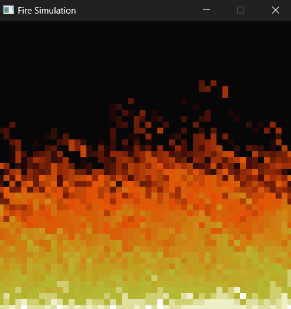

# Fire Simulation in Rust using ggez

This project implements a fire simulation using Rust and the `ggez` game development library. The simulation is inspired by the classic "fire effect" technique used in early computer graphics.



## Overview

The fire simulation works by propagating fire intensities through a grid of pixels. Each pixel's intensity is determined based on the intensity of the pixel below it, creating a dynamic and realistic flame effect.

## Installation

To compile and run this project, you need to have Rust and Cargo installed. You can install them using `rustup`:

```sh
curl --proto '=https' --tlsv1.2 -sSf https://sh.rustup.rs | sh
source $HOME/.cargo/env
```

Once Rust and Cargo are installed, clone this repository and navigate to its directory:

```sh
git clone https://github.com/yourusername/fire_simulation.git
cd fire_simulation
```

## Running the Simulation

To run the simulation, use Cargo to build and execute the project:

```sh
cargo run
```

## Code Explanation

### Structure

The project consists of a single Rust source file, `main.rs`, which includes the entire logic for the fire simulation.

### Fire Simulation Logic

1. **Fire Palette**: A predefined palette of colors is used to represent different fire intensities. This palette ranges from dark colors (low intensity) to bright colors (high intensity).

2. **Fire Array**: A 1D array of `u8` values is used to store the fire intensities for each pixel in a 2D grid.

3. **Initialization**: The fire array is initialized with zeroes, and the bottom row of the array is set to the maximum intensity to create the source of the fire.

4. **Propagation**: The fire intensity of each pixel is updated based on the pixel directly below it. A random decay value is subtracted to simulate the cooling of the fire as it rises.

5. **Rendering**: Each pixel is drawn as a rectangle on the screen, with its color determined by its intensity value from the fire palette.

### Key Functions

- `create_fire_source()`: Initializes the bottom row of the fire array with the maximum intensity.
- `update_fire_intensity()`: Updates the intensity of a pixel based on the pixel below it and a random decay factor.
- `calculate_fire_propagation()`: Iterates through all pixels to propagate the fire effect.
- `draw_fire()`: Renders the fire effect on the screen using the `ggez` graphics library.

### Main Loop

The main loop of the program runs the simulation by repeatedly calling the `update` and `draw` methods of the `FireSimulation` struct. The `ggez` library handles the window creation, event handling, and rendering.

```rust
fn main() -> GameResult {
    let cb = ggez::ContextBuilder::new("Fire Simulation", "ggez")
        .window_setup(conf::WindowSetup::default().title("Fire Simulation"))
        .window_mode(conf::WindowMode::default().dimensions(SCREEN_WIDTH, SCREEN_HEIGHT));
    let (mut ctx, event_loop) = cb.build()?;
    let sim = FireSimulation::new();
    event::run(ctx, event_loop, sim)
}
```

### Techniques

This fire generation technique is based on a simple yet effective method used in early computer graphics:

1. **Grid-Based Propagation**: The fire effect is simulated on a 2D grid where each pixel's state is influenced by its neighbors.
2. **Random Decay**: A random decay value is used to simulate the natural cooling of the fire as it rises, adding variability and realism to the effect.
3. **Color Palette**: A carefully chosen palette of colors provides a smooth gradient from cool to hot colors, enhancing the visual appeal of the fire.

## Dependencies

This project relies on the following Rust crates:

- `ggez`: A lightweight game framework for Rust, providing the necessary tools for window management, rendering, and event handling.
- `rand`: A library for generating random numbers, used here to introduce randomness in the fire propagation.

Add these dependencies in your `Cargo.toml` file:

```toml
[dependencies]
ggez = "0.7.0"
rand = "0.8.4"
```

## License

This project is licensed under the MIT License.

## Acknowledgements

This project is inspired by the classic fire effect used in early computer graphics and adapted to Rust and `ggez` by various tutorials and examples found in the game development community.

---

Feel free to contribute to this project by submitting issues or pull requests. Enjoy the fire simulation!
